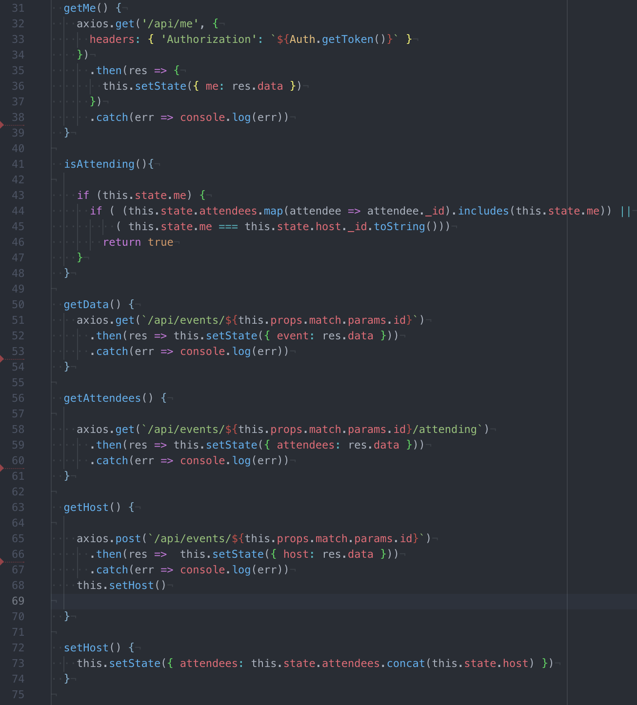
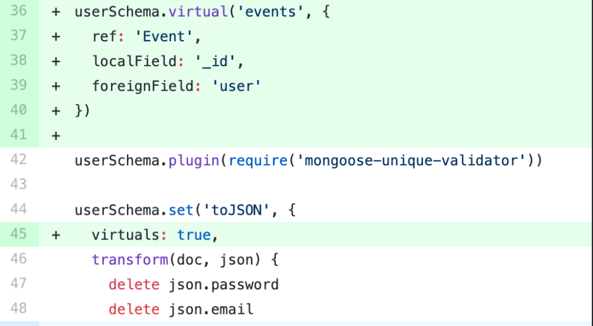

# SEI - 41 - GROUP PROJECT
---

## Brief
The third project of the GA course is a small group project with the aim of creating a MERN Stack App, utilising a custom built API.

## Technical Requirements
Build a full-stack application
Use an Express API
Consume the API using a separate front-end, built with React
Be a complete product
Implement thoughtful user stories/wireframes to highlight core MVP
Have a visually impressive design
Be deployed online
Have automated tests for at least one RESTful resource.

## Deliverables
A working appGitHub - Lily-La-Day/lily-la-day
A link to the hosted working app
A git repository on Github
This Readme!

## Team
Ola - [leealex88 · GitHub](https://github.com/leealex88)
Lily - [Lily-La-Day · GitHub](https://github.com/Lily-La-Day)
Charles - [CPrich905 · GitHub](https://github.com/CPrich905)

---
## Technologies used
* HTML5
* SCSS and Skeleton
* JavaScript (ECMAScript6)
* React.js
* GitHub
* Express

## Dependencies
* Axios
* Bcrypt
* Body-parser
* Filestack-react
* jsonwebtoken
* Mapbox
* Mongoose, mongoose-unique-validator
* React-time-picker, react-calendar, react-moment

## Our Approach
Our intention was to develop a friend and activity finder for people living in London, that would allow users to connect with each other based on common interests, not physical appearance or romantic interest.

With our initial idea in place, we began by story-boarding our user journey and identifying the actions required for a Minimum Viable Product.
	* A database of events for users to attend, visible only after login.
	* A database of users, visible only after login.
	* Users must be able to:
		* Register & login
		* Request to attend events
		* Create events
		* Message other users
		* /Edit their profile - currently a limited feature/
	* Event owners must be able to:
		* Approve attendees
		* Set private data (e.g. personal address/contact phone number)
		* /Be able to edit & delete events they own - not a current feature/

## User story
Our homepage is simple - a background image with the name of our site clearly displayed. A mouse click on the page reveals the options to login or register a new user:

(img 1: homepage showing Register and Login options)

The registration asks for a unique username, a password & confirmation, email address and a brief bio. Once these details are entered, the user is taken to the login page, then to the index of events.

On choosing an event, the user is taken to the initial event card. Here they can see the owner,  the location (by London Borough), users attending, and have the option to request to attend the event. When this request is approved by the event owner, the user will also be able to see the private data around the event and the message board between attendees.

From the Navbar, the user can choose the following options: Events,  Create Event, My Profile, All Users or Logout.

(img 2: Navbar)

*Stranger Things* Takes the user to the index of events.

*Create Event:* The user is asked for the essential information first: a type, name and date. They can provide further information, such as a schedule for the event, equipment that’s needed, links to tickets, etc.
On submission, the user is taken to the events index, where their new event is displayed.

*My Profile:* Displays the user’s public information and also allows them to add further detail to their profile by adding interests and an avatar image. They also see notifications for any private messages from other users or requests to attend events. At the bottom of the user profile is a list of events they are attending.

*All Users:* This displays the users from our current database. The information shown here is the avatar image and username. On choosing a user, you see their public profile. This includes the user bio, interests, events they are attending, events they are hosting, and options to send a private message or a comment on their profile so feedback can be left if you have attended an event with them.

*Logout:* logs the user out and returns them to the homepage.

## Future development
	* Error handling - our errors currently display either in the developer tools or in terminal, but do not pass any of this information back to the user.
	* Incorporate more events from [The List API](https://api.list.co.uk/)
	* Search users by interest/tags (currently running, but through the event tags)
	* User can choose whether the events they are attending are shown on their profile.
	* User profile to include a private calendar of events

## Major hurdles
*Linking Events and Users*
One of the biggest stumbling blocks we encountered was connecting the user and the events as several functions relied on having the attendees and owner linked to the events  While we reached a working solution, the current code is not as DRY as it could be, nor does it play to the strengths of the technologies used.

(img :
	* getMe - takes the current user, checks to see if they are attending the event they are looking at
	* isAttending - checks the list of attendees on the event against the current user.
	* getData -  sets event data in state
	* getAttendees - makes a Get request for attendees of the event.
	* getHost -  finds the event creator
	* setHost -  sets the event creator as host in state.
	)

While a preferred option was suggested by our instructors, there were too many features reliant on our original code for us to de-tangle this in time for submission.

Preferred method: add the code below to the user model, setting a virtual field that pulls the user from the event model.

This virtual field allows a two-way relationship between the owner and the event, meaning the id of the user can be pulled from the event and vice versa.

Adding an empty array of attendees to our event Schema - this will allow us to push users to this array on when their request to attend has been approved, eliminating the need for another Get request. This array can then be checked against the current user (getMe) when viewing the event as certain fields are only visible to attendees.

Using this alternative code would make our app more robust in the longer term, make our code DRYer and allow for a more effective and complete testing suite.

*Incorporating third party components*
We have utilised third party components at several stages on our app, most obviously when taking time and date inputs while creating a new event (src/ components/ events/ eventsFormParts.js).

While this was not a large challenge, this did become a time-sink for us as it required a fair amount of trial and error.

*Styling*
With the use of 3rd party components, styling came with its fair share of issues as well. We had been challenged to use either modified Bulma or an alternative CSS framework that we hadn’t used before. As a group, we decided to use Skeleton, a light-weight framework that claims to be ideal for small-scale projects such as this.

While the initial layout was relatively quick and played to the strengths of Skeleton, as could be expected from their documentation, further styling required custom CSS. This became harder when we encountered embedded styling on components such as the maps, clock and calendar inserts.

The most useful tool for us in identifying what should be styled and where it was located was the React developer tools in Google Chrome.

*GitHub*
This was our first project  working together as a group and using GitHub to coordinate the different parts we are working on. This resulted in a very steep learning curve for all of us as we built our familiarity with working branches and committing our updates.

## Unsolved Problems
While we do not have any unresolved issues by hand in, we felt there were also opportunities to clean up our code. This is something we will have to continue working on independently as we improve our portfolios.
